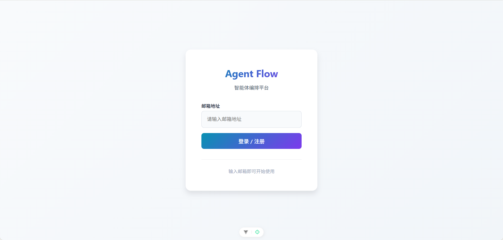
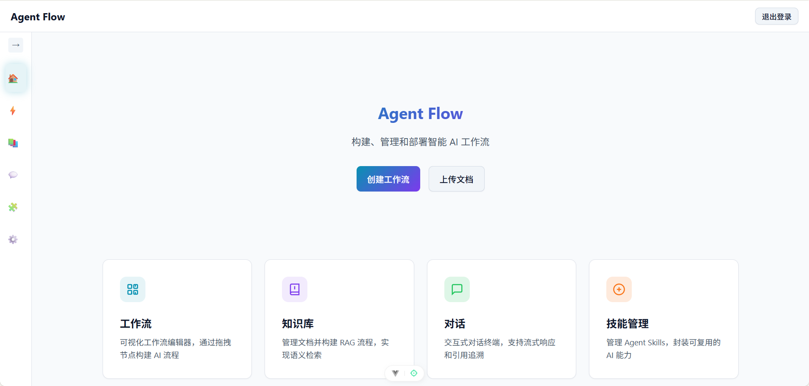
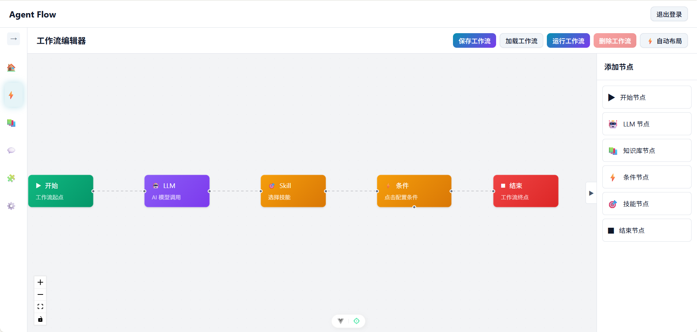
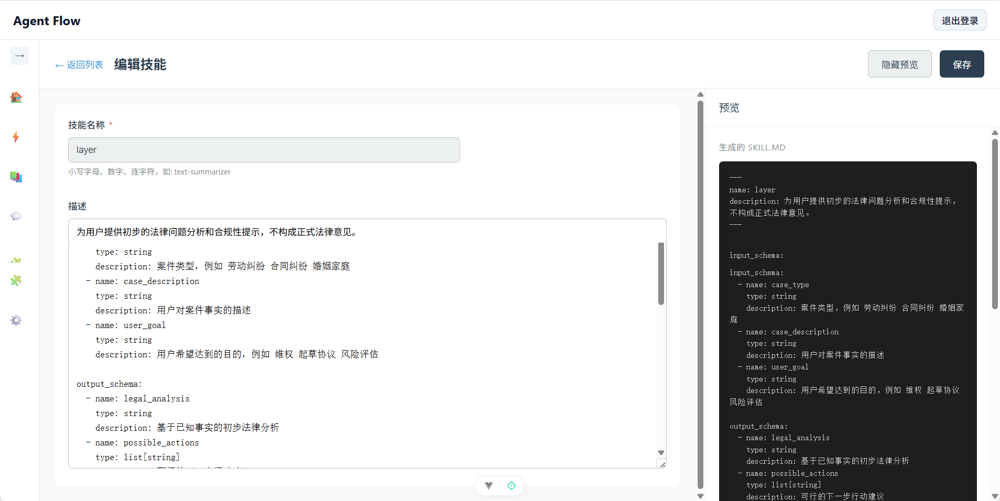

# Agent Flow Lite

面向个人开发者和小团队的单机全栈 AI Agent 编排平台。零外部服务依赖（无需 Redis / PostgreSQL / 消息队列），SQLite + 文件存储，clone 后 5 分钟内完成本地部署。

**核心能力**：可视化工作流编排、RAG 知识检索、SSE 流式对话、基于 SKILL.md 的技能系统。

**SKILL.md 是什么？** 每个技能就是一个 Markdown 文件——YAML frontmatter 声明输入变量，正文即 Prompt 模板。纯文本、Git 友好、可跨项目复用。这是 Dify / LangFlow / FlowiseAI 等平台没有的能力：技能定义不锁在数据库里，而是作为文件随代码版本管理。


[![zread](https://img.shields.io/badge/Ask_Zread-_.svg?style=flat&color=00b0aa&labelColor=000000&logo=data%3Aimage%2Fsvg%2Bxml%3Bbase64%2CPHN2ZyB3aWR0aD0iMTYiIGhlaWdodD0iMTYiIHZpZXdCb3g9IjAgMCAxNiAxNiIgZmlsbD0ibm9uZSIgeG1sbnM9Imh0dHA6Ly93d3cudzMub3JnLzIwMDAvc3ZnIj4KPHBhdGggZD0iTTQuOTYxNTYgMS42MDAxSDIuMjQxNTZDMS44ODgxIDEuNjAwMSAxLjYwMTU2IDEuODg2NjQgMS42MDE1NiAyLjI0MDFWNC45NjAxQzEuNjAxNTYgNS4zMTM1NiAxLjg4ODEgNS42MDAxIDIuMjQxNTYgNS42MDAxSDQuOTYxNTZDNS4zMTUwMiA1LjYwMDEgNS42MDE1NiA1LjMxMzU2IDUuNjAxNTYgNC45NjAxVjIuMjQwMUM1LjYwMTU2IDEuODg2NjQgNS4zMTUwMiAxLjYwMDEgNC45NjE1NiAxLjYwMDFaIiBmaWxsPSIjZmZmIi8%2BCjxwYXRoIGQ9Ik00Ljk2MTU2IDEwLjM5OTlIMi4yNDE1NkMxLjg4ODEgMTAuMzk5OSAxLjYwMTU2IDEwLjY4NjQgMS42MDE1NiAxMS4wMzk5VjEzLjc1OTlDMS42MDE1NiAxNC4xMTM0IDEuODg4MSAxNC4zOTk5IDIuMjQxNTYgMTQuMzk5OUg0Ljk2MTU2QzUuMzE1MDIgMTQuMzk5OSA1LjYwMTU2IDE0LjExMzQgNS42MDE1NiAxMy43NTk5VjExLjAzOTlDNS42MDE1NiAxMC42ODY0IDUuMzE1MDIgMTAuMzk5OSA0Ljk2MTU2IDEwLjM5OTlaIiBmaWxsPSIjZmZmIi8%2BCjxwYXRoIGQ9Ik0xMy43NTg0IDEuNjAwMUgxMS4wMzg0QzEwLjY4NSAxLjYwMDEgMTAuMzk4NCAxLjg4NjY0IDEwLjM5ODQgMi4yNDAxVjQuOTYwMUMxMC4zOTg0IDUuMzEzNTYgMTAuNjg1IDUuNjAwMSAxMS4wMzg0IDUuNjAwMUgxMy43NTg0QzE0LjExMTkgNS42MDAxIDE0LjM5ODQgNS4zMTM1NiAxNC4zOTg0IDQuOTYwMVYyLjI0MDFDMTQuMzk4NCAxLjg4NjY0IDE0LjExMTkgMS42MDAxIDEzLjc1ODQgMS42MDAxWiIgZmlsbD0iI2ZmZiIvPgo8cGF0aCBkPSJNNCAxMkwxMiA0TDQgMTJaIiBmaWxsPSIjZmZmIi8%2BCjxwYXRoIGQ9Ik00IDEyTDEyIDQiIHN0cm9rZT0iI2ZmZiIgc3Ryb2tlLXdpZHRoPSIxLjUiIHN0cm9rZS1saW5lY2FwPSJyb3VuZCIvPgo8L3N2Zz4K&logoColor=ffffff)](https://zread.ai/Joe-rq/agent-flow-lite)

---

## ✨ 核心特性

- 🎨 **可视化工作流** - 拖拽式节点编排，支持 LLM、知识库、条件分支、Skill 调用
- 📚 **RAG 知识管理** - 文档上传、智能分块、向量检索，自动处理嵌入维度
- 💬 **智能对话终端** - SSE 流式响应、多轮会话、引用溯源、@Skill 调用
- 🔧 **Skill 技能系统** - 可复用的 Prompt 模板，支持变量输入、知识库关联
- 👤 **用户管理系统** - 完整的认证授权、管理员用户管理、会话隔离
- ⚡ **现代化技术栈** - Vue 3 + FastAPI + LlamaIndex + ChromaDB

---

## 🆚 为什么选 Agent Flow Lite

| 能力 | Dify / LangFlow / Flowise | Agent Flow Lite |
|------|---------------------------|-----------------|
| **部署依赖** | PostgreSQL + Redis + 消息队列 | SQLite + 文件存储，零外部依赖 |
| **部署时间** | Docker Compose + 配置调优 | `./install.sh && ./start.sh`，5 分钟 |
| **技能定义** | 锁在数据库，导出为 JSON | SKILL.md 纯文本，Git 版本控制 + diff |
| **工作流断点续跑** | 不支持 | 每节点 checkpoint，断线可恢复 |
| **LLM 多模型** | 支持 | DeepSeek / OpenAI / Qwen / Ollama 四提供商 |
| **适用场景** | 团队/企业级，需运维 | 个人开发者/小团队，开箱即用 |

> Agent Flow Lite 不是 Dify 的简化版。它是为**不想维护基础设施的开发者**设计的独立工具——你的工作流和技能跟代码一起提交到 Git，而不是锁在某个平台的数据库里。

---

## 📸 界面预览

### 登录页


### 首页


### 工作流编辑器


### 技能管理


---

## 🚀 快速开始

### 1. 环境准备

确保已安装以下工具：

| 工具 | 版本要求 | 安装指南 |
|------|---------|---------|
| Node.js | ^20.19.0 或 >=22.12.0 | [nodejs.org](https://nodejs.org/) |
| Python | >=3.11 | [python.org](https://www.python.org/) |
| uv | 最新版 | [astral.sh/uv](https://github.com/astral-sh/uv) |

### 2. 获取 API Keys

本项目需要以下 API 服务：

- **DeepSeek API** - 用于 LLM 对话 → [注册获取](https://platform.deepseek.com/)
- **SiliconFlow API** - 用于文本向量化 → [注册获取](https://siliconflow.cn/)

### 3. 安装与配置

#### 方式一：一键脚本（推荐）

```bash
# 克隆仓库
git clone https://github.com/Joe-rq/agent-flow-lite.git
cd agent-flow-lite

# 安装依赖
./install.sh

# 配置环境变量
cp backend/.env.example backend/.env
# 编辑 backend/.env，填入你的 API Keys

# 启动服务
./start.sh
```

#### 方式二：手动安装

```bash
# 前端
cd frontend
npm install

# 后端
cd backend
uv venv
uv pip install -e .
cp .env.example .env
# 编辑 .env 文件
```

**环境变量配置** (`backend/.env`)：

```env
# DeepSeek API（必需）
DEEPSEEK_API_KEY=sk-xxxxx
DEEPSEEK_API_BASE=https://api.deepseek.com
DEEPSEEK_MODEL=deepseek-chat

# SiliconFlow API（必需）
SILICONFLOW_API_KEY=sk-xxxxx
SILICONFLOW_API_BASE=https://api.siliconflow.cn/v1
EMBEDDING_MODEL=BAAI/bge-m3

# 服务器配置（可选）
HOST=0.0.0.0
PORT=8000
DEBUG=true
CORS_ORIGINS=http://localhost:5173
```

### 4. 启动应用

```bash
# 启动前端（终端 1）
cd frontend
npm run dev

# 启动后端（终端 2）
cd backend
uv run uvicorn main:app --reload
```

### 5. 访问应用

| 服务 | 地址 | 说明 |
|------|------|------|
| 前端应用 | http://localhost:5173 | 主界面 |
| API 文档 | http://localhost:8000/docs | Swagger UI |
| 健康检查 | http://localhost:8000/health | 服务状态 |

---

## 📖 使用指南

### 工作流编排

1. 进入「工作流」页面
2. 点击「新建工作流」
3. 从左侧拖拽节点到画布
4. 连接节点，配置参数
5. 保存并测试工作流

**支持的节点类型**：
- **Start** - 工作流入口
- **LLM** - 调用大语言模型
- **Knowledge** - 检索知识库
- **Skill** - 调用预定义技能（支持变量替换）
- **Condition** - 条件分支
- **End** - 工作流出口

### 知识库管理

1. 进入「知识库」页面
2. 创建新知识库
3. 上传文档（支持 .txt、.md）
4. 系统自动分块和向量化
5. 在对话中引用知识库

> **注意**：更改 `EMBEDDING_MODEL` 后，现有知识库需要重建索引。搜索时会返回 409 错误提示重建。

### Skill 技能管理

1. 进入「技能管理」页面
2. 创建新 Skill（Markdown 格式，YAML frontmatter）
3. 定义输入变量、Prompt 模板、可选关联知识库
4. 在工作流中作为节点使用，或在对话中通过 `@skill-name` 调用
5. 支持独立测试运行

**Skill 文件格式示例**：
```yaml
---
name: article-summary
description: 文章总结
inputs:
  - name: content
    type: string
    required: true
---

请总结以下内容：

{{content}}
```

### 智能对话

1. 进入「对话」页面
2. 选择知识库或工作流（可选）
3. 输入问题，实时获取回复
4. 使用 `@skill-name` 语法调用 Skill（如 `@article-summary 这是一篇文章...`）
5. 查看思维链和引用来源
6. 点击「引用」按钮查看详细来源信息和文本摘录

### 用户管理（管理员）

1. 管理员进入「管理」页面
2. 查看所有用户列表
3. 启用/禁用用户账号
4. 删除用户账号

---

## 🏗️ 技术架构

### 技术栈

**前端**
- Vue 3 + Vite + TypeScript
- Vue Flow（工作流画布）
- **Composable 架构** - 逻辑抽取至可复用 composables，大组件拆分至 <=200 行
- Pinia（状态管理）
- Axios（HTTP 客户端）

**后端**
- FastAPI + Python 3.11+
- SQLAlchemy 2.0 + aiosqlite（异步 ORM）
- LlamaIndex（RAG 框架）
- ChromaDB（向量数据库）
- DeepSeek API（LLM）
- SiliconFlow API（Embedding）

### 项目结构

```
agent-flow-lite/
├── frontend/              # Vue 3 前端（组件化 + Composable 架构）
│   ├── src/
│   │   ├── views/              # 页面组件（已拆分至 <=200 行）
│   │   │   ├── AdminUsersView.vue     # 用户管理（管理员）
│   │   │   ├── ChatTerminal.vue       # 对话终端
│   │   │   ├── KnowledgeView.vue      # 知识库管理
│   │   │   ├── LoginView.vue          # 登录/注册
│   │   │   ├── SkillEditor.vue        # Skill 编辑器
│   │   │   ├── SkillsView.vue         # Skill 列表
│   │   │   ├── WorkflowEditor.vue     # 工作流编排
│   │   │   └── ...
│   │   ├── components/         # 组件
│   │   │   ├── nodes/          # 工作流节点
│   │   │   │   ├── SkillNode.vue
│   │   │   │   ├── LLMNode.vue
│   │   │   │   └── ...
│   │   │   ├── knowledge/      # 知识库子组件
│   │   │   │   ├── KbUploadArea.vue
│   │   │   │   ├── KbSearchTest.vue
│   │   │   │   └── KbDocumentTable.vue
│   │   │   ├── workflow/       # 工作流子组件
│   │   │   │   ├── NodeDrawer.vue
│   │   │   │   ├── WorkflowRunDialog.vue
│   │   │   │   └── WorkflowLoadDialog.vue
│   │   │   ├── chat/           # 对话子组件
│   │   │   │   ├── ChatSidebar.vue
│   │   │   │   ├── ChatMessageList.vue
│   │   │   │   └── ChatInputBar.vue
│   │   │   ├── skills/         # Skill 子组件
│   │   │   │   ├── SkillRunDialog.vue
│   │   │   │   └── SkillPreviewPane.vue
│   │   │   └── config/         # 节点配置子组件
│   │   │       ├── LlmNodeConfig.vue
│   │   │       └── SkillNodeConfig.vue
│   │   ├── composables/        # 可复用逻辑（按域组织）
│   │   │   ├── useSSEStream.ts
│   │   │   ├── useSkillAutocomplete.ts
│   │   │   ├── useUserAdmin.ts
│   │   │   ├── knowledge/
│   │   │   │   └── useKnowledgeApi.ts
│   │   │   ├── workflow/
│   │   │   │   ├── useWorkflowCrud.ts
│   │   │   │   ├── useWorkflowExecution.ts
│   │   │   │   ├── useNodeDragDrop.ts
│   │   │   │   └── useNodeConfig.ts
│   │   │   ├── chat/
│   │   │   │   ├── useChatSession.ts
│   │   │   │   └── useChatSSE.ts
│   │   │   └── skills/
│   │   │       ├── useSkillRunner.ts
│   │   │       └── useSkillForm.ts
│   │   ├── stores/             # Pinia 状态管理
│   │   └── __tests__/          # 测试文件
│   └── package.json
│
├── backend/               # FastAPI 后端
│   ├── app/
│   │   ├── api/          # API 路由
│   │   │   ├── admin.py          # 用户管理（管理员）
│   │   │   ├── auth.py           # 认证授权
│   │   │   ├── chat.py           # 对话接口
│   │   │   ├── chat_session.py   # 会话管理
│   │   │   ├── chat_stream.py    # SSE 流式对话
│   │   │   ├── knowledge.py      # 知识库接口
│   │   │   ├── skill.py          # Skill 管理
│   │   │   └── workflow.py       # 工作流接口
│   │   ├── core/         # 核心逻辑
│   │   │   ├── auth.py           # JWT 认证
│   │   │   ├── chroma_client.py  # ChromaDB 客户端
│   │   │   ├── config.py         # 配置管理
│   │   │   ├── database.py       # SQLAlchemy ORM
│   │   │   ├── knowledge/        # RAG 知识库模块
│   │   │   │   ├── processor.py   # 文档处理
│   │   │   │   └── store.py      # 向量存储
│   │   │   ├── llm.py            # LLM 客户端
│   │   │   ├── paths.py          # 路径工具
│   │   │   ├── rag.py            # RAG 管道
│   │   │   ├── skill/           # Skill 模块
│   │   │   │   ├── executor.py   # Skill 执行器
│   │   │   │   └── loader.py     # Skill 加载器
│   │   │   └── workflow/        # 工作流引擎模块
│   │   │       ├── context.py    # 执行上下文
│   │   │       ├── engine.py     # 工作流引擎
│   │   │       └── nodes.py      # 节点定义
│   │   └── models/       # 数据模型
│   │       ├── skill.py          # Skill 模型
│   │       ├── user.py           # 用户模型
│   │       └── ...
│   ├── tests/            # 测试套件（13 个测试文件，含集成测试）
│   ├── data/             # 运行时数据
│   │   ├── chromadb/     # 向量数据
│   │   ├── sessions/     # 会话历史
│   │   ├── skills/       # Skill 存储
│   │   └── ...
│   └── main.py           # 应用入口
│
├── docs/                  # 项目文档
│   ├── skill-system-design.md
│   └── ...
├── scripts/               # CI 检查与质量门验证脚本
├── .github/workflows/     # GitHub Actions 工作流
├── AGENTS.md             # 开发规范与指南
├── CLAUDE.md             # Claude Code 指南
└── install.sh            # 一键安装脚本
```

### 核心模块

#### 1. RAG 管道

```
文档上传 → 文本分块 → 向量化 → 存储 → 检索
         (512 tokens)  (BGE-M3)  (ChromaDB)
```

- **分块策略**: LlamaIndex SentenceSplitter（512 tokens，50 overlap）
- **向量模型**: SiliconFlow BGE-M3
- **存储引擎**: ChromaDB 持久化
- **检索方式**: Top-K 相似度搜索

#### 2. 工作流引擎

```
图结构解析 → BFS 遍历 → 节点执行 → 数据流转
```

- **执行模式**: 异步生成器 + 事件流
- **数据传递**: 变量引用（`{{step1.output}}`）
- **分支控制**: 条件节点 + sourceHandle 路由
- **持久化**: JSON 文件存储

#### 3. SSE 流式对话

```
用户输入 → RAG 检索 → LLM 生成 → SSE 推送 → 前端渲染
```

- **协议**: Server-Sent Events
- **事件类型**: thought（思维链）、token（内容）、citation（引用）、done（完成）
- **会话管理**: JSON 文件 + FileLock 并发控制

---

## 💻 开发指南

### 前端开发

```bash
cd frontend

npm run dev          # 开发服务器
npm run test         # 一次性测试（CI 推荐）
npm run test:ui      # 测试 UI
npm run type-check   # 类型检查
npm run lint         # 代码检查
npm run format       # 代码格式化
npm run build        # 生产构建
npx vitest run src/__tests__/App.spec.ts  # 运行单个测试文件
```

### 后端开发

```bash
cd backend

uv pip install -e .                    # 安装依赖
uv run uvicorn main:app --reload       # 开发服务器
uv run pytest -q                       # 运行所有测试
uv run pytest tests/test_smoke.py -q   # 运行单个测试文件
uv run pytest -k "citation" -q         # 运行匹配模式的测试
```

### CI 与质量门（最近更新）

```bash
# 本地预检（推送前）
bash scripts/verify-quality-gate.sh

# 推送后查看最新质量门状态
bash scripts/check-ci-status.sh

# 或直接使用 gh 检查
gh run list --workflow="Quality Gate" --limit 3
gh run view <run-id> --json jobs --jq '.jobs[] | "\(.name): \(.conclusion)"'
```

Quality Gate 的关键检查是 4 项：
- `frontend-type-check`
- `frontend-build`
- `frontend-critical-tests`
- `backend-critical-tests`

### 代码规范

- **前端**: Prettier + ESLint + OXLint
- **后端**: PEP 8 + 类型提示 + 文档字符串
- **提交**: Conventional Commits（`feat:`, `fix:`, `docs:`）

### 添加新功能

**添加工作流节点类型**：
1. 在 `backend/app/core/workflow/nodes.py` 添加执行函数
2. 在 `backend/app/core/workflow/engine.py` 注册节点类型
3. 在 `frontend/src/components/nodes/` 创建节点组件
4. 在 `frontend/src/views/WorkflowEditor.vue` 添加节点配置

**扩展 RAG 管道**：
1. 修改 `backend/app/core/rag.py` 中的分块或检索逻辑
2. 更新 `backend/app/api/knowledge.py` 中的接口
3. 调整前端 `KnowledgeView.vue` 的 UI

**添加新 Skill**：
1. 在 `backend/data/skills/` 创建新文件夹
2. 编写 `SKILL.md`（YAML frontmatter + Prompt 模板）
3. 在「技能管理」页面查看和使用

---

## 🔒 安全边界

本项目面向个人开发者和小团队的本地/内网部署场景，**不适合在生产环境运行不受信任的用户代码**。各安全组件的能力边界如下：

| 组件 | 机制 | 适用场景 | 已知局限 |
|------|------|---------|---------|
| 代码沙箱 | AST 级模块黑名单 + 子进程资源限制（`RLIMIT_AS` / `RLIMIT_CPU`） | 开发/演示环境的基本防护 | 非容器/seccomp 隔离，`__class__.__bases__` 等反射链可绕过 AST 检查 |
| SSRF 防护 | 私有网段黑名单 + DNS 预解析验证 | 纵深防御，阻止常见 SSRF 向量 | 不防御 DNS Rebinding、302 跳转到内网等高级攻击 |
| 认证系统 | bcrypt 密码散列 + UUID Token + SQLite 存储 | 单实例部署 | 非 JWT，Token 无过期机制，不适合分布式部署 |
| 审计日志 | 仅追加写入文件 | 事后排查参考 | 非防篡改设计，无签名校验 |

> **重要声明**：如需运行不受信任的用户代码，请使用容器隔离（如 gVisor / Firecracker）替代内置沙箱。

---

## ❓ 常见问题

<details>
<summary><strong>ChromaDB 维度不匹配 (409 错误)</strong></summary>

**错误**: `Knowledge base index is incompatible with current embedding model`
或 `InvalidDimensionException`

**原因**: 更换 `EMBEDDING_MODEL` 后，现有知识库的向量维度与新模型不匹配

**解决**:
```bash
# 1. 删除旧向量数据
rm -rf backend/data/chromadb/

# 2. 重新上传文档建立索引
```

**提示**: 系统现在会返回 409 错误并提示重建，而不是随机 500 错误。
</details>

<details>
<summary><strong>SSE 流式响应不工作</strong></summary>

**症状**: 前端收不到流式数据

**排查步骤**:
1. 检查后端服务: `curl http://localhost:8000/health`
2. 检查 CORS 配置: `backend/.env` 中的 `CORS_ORIGINS`
3. 如使用 Nginx: 添加 `proxy_buffering off;`
</details>

<details>
<summary><strong>API Key 错误</strong></summary>

**错误**: `401 Unauthorized` 或 `Invalid API Key`

**解决**:
1. 确认 `backend/.env` 文件存在
2. 检查 API Key 格式（通常以 `sk-` 开头）
3. 访问对应平台确认 Key 有效
4. 重启后端服务
</details>

<details>
<summary><strong>前端代理错误</strong></summary>

**错误**: `ECONNREFUSED` 或 `502 Bad Gateway`

**原因**: 后端服务未启动或端口不匹配

**解决**:
1. 确保后端运行在 8000 端口
2. 检查 `frontend/vite.config.ts` 中的 proxy 配置
3. 查看后端日志排查错误
</details>

<details>
<summary><strong>Skill 调用失败</strong></summary>

**症状**: `@skill-name` 调用无响应或报错

**排查步骤**:
1. 检查 Skill 名称是否正确（区分大小写）
2. 确认 Skill 文件格式正确（YAML frontmatter + Markdown）
3. 检查 required 输入变量是否提供
4. 查看浏览器 Network 面板中的 SSE 响应
</details>

---

## 🤝 贡献指南

欢迎贡献代码、报告问题或提出建议！

### 贡献流程

1. Fork 本仓库
2. 创建功能分支 (`git checkout -b feature/amazing-feature`)
3. 提交更改 (`git commit -m 'feat: add amazing feature'`)
4. 推送分支 (`git push origin feature/amazing-feature`)
5. 创建 Pull Request

### 开发规范

- ✅ 遵循现有代码风格
- ✅ 添加必要的注释和文档
- ✅ 提交前运行测试和检查
- ✅ 使用语义化提交信息

---

## 📄 许可证

本项目采用 [MIT License](LICENSE) 开源协议。

---

## 🔗 相关资源

### 官方文档
- [Vue Flow](https://vueflow.dev/) - 工作流画布组件
- [FastAPI](https://fastapi.tiangolo.com/) - 后端框架
- [LlamaIndex](https://docs.llamaindex.ai/) - RAG 框架
- [ChromaDB](https://docs.trychroma.com/) - 向量数据库

### API 服务
- [DeepSeek API](https://platform.deepseek.com/docs) - LLM 服务
- [SiliconFlow API](https://docs.siliconflow.cn/) - Embedding 服务

### 项目文档
- [CLAUDE.md](./CLAUDE.md) - Claude Code 使用指南
- [AGENTS.md](./AGENTS.md) - 开发规范与指南
- [docs/README.md](./docs/README.md) - 文档索引
- [docs/skill-system-design.md](./docs/skill-system-design.md) - Skill 系统设计
- [docs/vibe-coding-guide.html](./docs/vibe-coding-guide.html) - 开发指南

---

<div align="center">

**⭐ 如果这个项目对你有帮助，欢迎 Star！**

Made with ❤️ by the Agent Flow Lite Team

</div>
